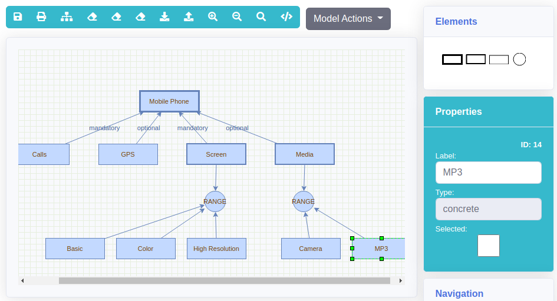

# Representación Gráfica

El manejo de la variabilidad de cientos de componentes y la posible derivación de miles de productos hace de las líneas de productos un problema complejo. Hemos podido aprender de la historia del desarrollo software y sistemas, que la abstracción de todas estas complejidades juega un papel fundamental para poder trabajar efectivamente en este tipo de problemas. La conceptualización de requisitos comunes y variables de una colección de productos y su organización en un modelo, puede ser una buena opción para gestionar la complejidad de la línea de productos. 

Los modelos de características (o por sus siglas en inglés FM) son una técnica gráfica popular de modelado de variabilidad, son una representación de todos los posibles productos que pueden ser derivados de una línea de productos de software en términos de sus características. Estos modelos son utilizados a lo largo del desarrollo de una línea de producto de software, sirviendo como insumo para otros procesos y funcionan para la generación de arquitecturas, documentos e incluso código. 

Los feature models pueden ser utilizados para derivar todo tipo de producto, en este documento presentaremos como ejemplo canónico un feature model para la derivación de teléfonos celulares. {cite}`TORO_2017`

<br/>


<br/>

Los modelos de características en VariaMos son construidos utilizando MXGraph, esta tecnología nos permite poder integrar fácilmente componentes gráficos a librerías modernas de desarrollo frontend como es Vue.js haciendo fácil diseñar una UX/UI adecuada para quienes deseen utilizar la herramienta. MXGraph utiliza XML para generar su representación interna, es esta la que nos permite poder armar, construir y mostrar los FM de forma exitosa. Es importante entender cómo se representan cada uno de los componentes del feature model en esta representación.

<br/>



<br/>

A pesar de las ventajas de la representación gráfica, estas no pueden ser analizadas directamente por un computador, tampoco son ideales para ser reutilizadas en otros proyectos o incluso otras herramientas de manejo de líneas de producto de software. La transformación de este tipo de modelos a representaciones más adecuada para estos trabajos será un tema que será explorado en los siguientes capítulos.

## Características

Las caracteristicas son los atributos que agregan value a un cliente y distinguen un producto de sus competidores en el mercado, generalmente se representan con una caja en la que dentro se encuentra el nombre de la caracteristica.

- **Raíz:** Esta es una relación implícita, esto quiere decir no existe una flecha que la denote. Esta restricción es especialmente importante, ya que indica desde donde inicia el modelo y siempre debe estar seleccionada, ya que si no lo está será imposible derivar productos, adicional en un modelo debe existir una y solo una raíz.

```xml
<root label="Mobile Phone" type="root" id="1">
  <mxCell style="strokeWidth=3" vertex="1" parent="feature">
    <mxGeometry x="195" width="100" height="35" as="geometry"/>
  </mxCell>
</root>
```

- **Abstracta:** Permite añadir estructura al modelo, no es necesariamente una característica específica como "GPS" pero es una característica que agrega múltiples características concretas como "Screen" en nuestro ejemplo canónico. Esto permite hacer relaciones entre categorías amplias de características agrupadas.

```xml
<abstract label="abstract" type="abstract" id="2">
  <mxCell style="strokeWidth=2" vertex="1" parent="feature">
    <mxGeometry x="370" y="120" width="100" height="35" as="geometry"/>
  </mxCell>
</abstract>
```

- **Concreta:** Estas son las partes indivisibles del modelo de caracteristicas, siempre siendo la hojas del arbol que forma el modelo de caracteristicas, en nuestro ejemplo canonico serían caracteristicas como "GPS", "Basic" o "MP3".

```xml
<concrete label="concrete" type="concrete" selected="false" id="3">
  <mxCell style="" vertex="1" parent="feature">
    <mxGeometry x="370" y="140" width="100" height="35" as="geometry"/>
  </mxCell>
</concrete>
```


## Restricciones

Las restricciones son las relaciones que existen entre caracteristicas, estas muestran las formas en las que estas se pueden asociar para generar un articulo de una linea de productos, son generalmente representadas con flechas que salen de una característica y se dirigen a otra, con algunos signos espaciales que permiten clasificarla.

- **Opcional:** Es una relación entre una característica padre y una hija, hace referencia que cuando la característica padre pertenece a un producto, la característica hija puede o no hacer parte del mismo producto.

```xml
<rel_concrete_root type="relation" relType="optional" id="0.7">
  <mxCell style="noEdgeStyle=1;orthogonal=1;" edge="1" parent="feature" source="7" target="1">
    <mxGeometry relative="1" as="geometry">
      <Array as="points">
        <mxPoint x="50" y="123"/>
        <mxPoint x="211.25" y="47"/>
      </Array>
    </mxGeometry>
  </mxCell>
</rel_concrete_root>
```

- **Obligatoria:** Es una relación jerárquica entre un padre y un hijo, quiere decir que cuando el padre hace parte de un producto entonces necesariamente la característica hija también tiene que hacer parte del producto.

```xml
<rel_abstract_root type="relation" relType="mandatory" id="0.3">
  <mxCell style="noEdgeStyle=1;orthogonal=1;" edge="1" parent="feature" source="4" target="1">
    <mxGeometry relative="1" as="geometry">
      <Array as="points">
        <mxPoint x="287.5" y="123"/>
        <mxPoint x="256.25" y="49"/>
      </Array>
    </mxGeometry>
  </mxCell>
</rel_abstract_root>
```

- **Cardinal Grupal:** Esta relaciona un padre con múltiples hijos, adicional a las flechas que tradicionalmente vemos en otras restricciones, estas tienen una dupla de números, el primero representa la cantidad mínima de hijos que deben estar en el producto cuando el padre hace parte de él mismo, mientras que el segundo se refiere a la cantidad máxima de hijos seleccionados en el mismo escenario.

```xml
<bundle label="bundle" type="bundle" bundleType="RANGE" lowRange="1" highRange="1" id="6">
  <mxCell style="shape=ellipse" vertex="1" parent="feature">
    <mxGeometry x="400" y="130" width="35" height="35" as="geometry"/>
  </mxCell>
</bundle>

<rel_concrete_bundle type="relation" id="0.4">
  <mxCell edge="1" parent="feature" source="3" target="6">
    <mxGeometry relative="1" as="geometry"/>
  </mxCell>
</rel_concrete_bundle>

<rel_bundle_abstract type="relation" id="0.5">
  <mxCell edge="1" parent="feature" source="6" target="5">
    <mxGeometry relative="1" as="geometry"/>
  </mxCell>
</rel_bundle_abstract>
```

- **Requerida:** Es una relación entre dos características, una de origien y una de destino, estas no necesariamente deben tener la estructura jerárquica de padre he hija como en las restricciones anteriores, representa la necesidad de elegir la característica de destino cuando la de origen hace parte del producto a derivar.


```xml
<rel_concrete_concrete type="relation" relType="requires" id="0.3">
  <mxCell edge="1" parent="feature" source="3" target="4">
    <mxGeometry relative="1" as="geometry"/>
  </mxCell>
</rel_concrete_concrete>
```

- **Exclusión:** La exclusión también es una relación de origen y destino, esta expresa la imposibilidad de que tanto la característica de origen y la de destino hagan parte de un mismo producto.

```xml
<rel_concrete_concrete type="relation" relType="excludes" id="0.3">
  <mxCell edge="1" parent="feature" source="3" target="4">
    <mxGeometry relative="1" as="geometry"/>
  </mxCell>
</rel_concrete_concrete>
```

- **Logicas:** Son restricciones que permiten utilizar operadores de lógica proposicional, como AND, OR, XOR. Estas se crean entre una característica padre y múltiples características hijas.

```xml
<bundle label="bundle" type="bundle" bundleType="AND" lowRange="1" highRange="1" id="6">
  <mxCell style="shape=ellipse" vertex="1" parent="feature">
    <mxGeometry x="400" y="130" width="35" height="35" as="geometry"/>
  </mxCell>
</bundle>

<rel_concrete_bundle type="relation" id="0.4">
  <mxCell edge="1" parent="feature" source="3" target="6">
    <mxGeometry relative="1" as="geometry"/>
  </mxCell>
</rel_concrete_bundle>

<rel_bundle_abstract type="relation" id="0.5">
  <mxCell edge="1" parent="feature" source="6" target="5">
    <mxGeometry relative="1" as="geometry"/>
  </mxCell>
</rel_bundle_abstract>
```
